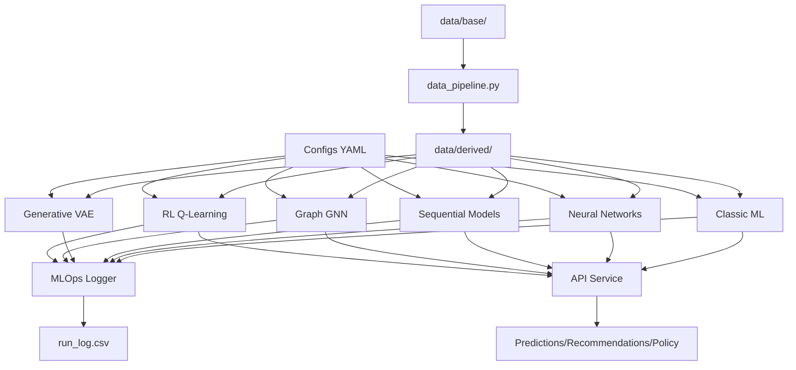

# System Architecture Diagram

## Overview
This document describes the system architecture for Final Project Phase 5 - Modular ML System.

**Note**: The actual diagram (System_Diagram.png) should be created using a diagramming tool like draw.io, Lucidchart, or similar.

## Diagram Components

### 1. Data Layer
```
┌─────────────────────────────────────────┐
│         DATA LAYER                      │
├─────────────────────────────────────────┤
│  data/base/                             │
│  ├── input.csv (NFL tracking data)      │
│  ├── graph_edges.csv (customer-product) │
│  └── gridworld.csv (5x5 rewards)        │
│                                          │
│  data/derived/ (gitignored)             │
│  ├── X_train.pkl, y_train.pkl          │
│  ├── X_val.pkl, y_val.pkl              │
│  └── X_test.pkl, y_test.pkl            │
└─────────────────────────────────────────┘
          ↓
```

### 2. Data Pipeline
```
┌─────────────────────────────────────────┐
│   DATA PIPELINE (integration/)          │
├─────────────────────────────────────────┤
│  data_pipeline.py                       │
│  ├── load_data()                        │
│  ├── engineer_features()                │
│  ├── construct_sequences()              │
│  ├── split_data()                       │
│  └── normalize_data()                   │
└─────────────────────────────────────────┘
          ↓
```

### 3. ML Components (Parallel Training)
```
┌──────────────┐  ┌──────────────┐  ┌──────────────┐
│   CLASSIC    │  │   NEURAL     │  │  SEQUENTIAL  │
├──────────────┤  ├──────────────┤  ├──────────────┤
│ Random Forest│  │ MLP          │  │ LSTM (text)  │
│ XGBoost      │  │ CNN (vision) │  │ Transformer  │
│ Logistic Reg │  │ LSTM (text)  │  │ Timeseries   │
└──────────────┘  └──────────────┘  └──────────────┘
        ↓                ↓                  ↓
```

```
┌──────────────┐  ┌──────────────┐  ┌──────────────┐
│  GENERATIVE  │  │    GRAPH     │  │      RL      │
├──────────────┤  ├──────────────┤  ├──────────────┤
│ VAE          │  │ Link Pred    │  │ Q-Learning   │
│ (augment)    │  │ GNN          │  │ (gridworld)  │
│              │  │ Recommender  │  │              │
└──────────────┘  └──────────────┘  └──────────────┘
        ↓                ↓                  ↓
```

### 4. MLOps Layer (Sidecar)
```
┌─────────────────────────────────────────┐
│         MLOPS (mlops/)                  │
├─────────────────────────────────────────┤
│  RunLogger (utils.py)                   │
│  ├── Log all experiments                │
│  ├── Track git commit                   │
│  ├── Hash data & configs                │
│  └── Append to run_log.csv              │
│                                          │
│  outputs/run_log.csv                    │
│  ├── run_id, timestamp, git_commit      │
│  ├── data_hash, config_hash, seed       │
│  ├── component, metric_name, value      │
│  └── latency_ms, params_json, notes     │
└─────────────────────────────────────────┘
```

### 5. Integration & Orchestration
```
┌─────────────────────────────────────────┐
│    ORCHESTRATION (integration/)         │
├─────────────────────────────────────────┤
│  orchestrate.py                         │
│  ├── load_config()                      │
│  ├── run_classic_stage()                │
│  ├── run_neural_stage()                 │
│  ├── run_sequential_stage()             │
│  ├── run_generative_stage()             │
│  ├── run_graph_stage()                  │
│  └── run_rl_stage()                     │
│                                          │
│  model_serialization.py                 │
│  └── save/load models                   │
└─────────────────────────────────────────┘
          ↓
```

### 6. API Service Layer
```
┌─────────────────────────────────────────┐
│         API SERVICE (api/)              │
├─────────────────────────────────────────┤
│  service.py (FastAPI)                   │
│  ├── POST /predict/tabular              │
│  ├── POST /recommend/:customer_id       │
│  ├── POST /forecast/ts                  │
│  └── GET /policy/gridworld              │
└─────────────────────────────────────────┘
          ↓
```

### 7. Outputs & Artifacts
```
┌─────────────────────────────────────────┐
│         OUTPUTS                         │
├─────────────────────────────────────────┤
│  outputs/models/                        │
│  ├── *.pkl (classic models)             │
│  └── *.pt (neural models)               │
│                                          │
│  outputs/artifacts/                     │
│  ├── confusion_matrix_*.png             │
│  ├── roc_curve_*.png                    │
│  ├── ts_forecast_*.png                  │
│  ├── graph_hitk_*.png                   │
│  └── rl_policy_*.png                    │
│                                          │
│  outputs/logs/                          │
│  └── training_*.log                     │
└─────────────────────────────────────────┘
```

### 8. Configuration Management
```
┌─────────────────────────────────────────┐
│         CONFIGS (YAML)                  │
├─────────────────────────────────────────┤
│  default.yaml   - Global settings       │
│  classic.yaml   - RF, XGB params        │
│  neural.yaml    - MLP, CNN, LSTM        │
│  sequential.yaml - Transformer, TS      │
│  generative.yaml - VAE settings         │
│  graph.yaml     - Link prediction       │
│  rl.yaml        - Q-learning            │
└─────────────────────────────────────────┘
```

### 9. Testing & Validation
```
┌─────────────────────────────────────────┐
│         TESTS (pytest)                  │
├─────────────────────────────────────────┤
│  test_data_contracts.py                 │
│  test_api_contract.py                   │
│  test_smoke_integration.py              │
└─────────────────────────────────────────┘
```

## Data Flow Diagram

```
[Raw Data]
    ↓
[Data Pipeline: Feature Engineering, Splits, Normalization]
    ↓
[Derived Data: train/val/test sets]
    ↓
┌───────────────────────────────────────────────┐
│                                               │
│  [Classic] → [Predictions]                    │
│     ↓                                         │
│  [Neural] → [Predictions + Uncertainty]       │
│     ↓                                         │
│  [Sequential] → [Trajectories + Classes]      │
│     ↓                                         │
│  [Generative] → [Augmented Data] → [Retrain]  │
│     ↓                                         │
│  [Graph] → [Recommendations]                  │
│     ↓                                         │
│  [RL] → [Policy]                              │
│                                               │
└───────────────────────────────────────────────┘
    ↓
[MLOps Logger: Track all experiments]
    ↓
[run_log.csv: Append-only experiment log]
    ↓
[API Service: Serve predictions]
    ↓
[Model Cards: Document for transparency]
```

## Key Design Principles

1. **Modularity**: Each component is independently trainable
2. **Reproducibility**: Seeds, hashes, git commits tracked
3. **Transparency**: Model cards document bias, privacy, limits
4. **Scalability**: API layer for production deployment
5. **Traceability**: All experiments logged to run_log.csv
6. **Immutability**: data/base/ never modified
7. **Configuration-driven**: YAML files control all hyperparameters

## Component Interactions

**Generative → Supervised**: VAE augments training data for classic/neural models

**Graph → API**: Link prediction provides recommendations endpoint

**Sequential → API**: Time-series models provide forecasting endpoint

**RL → API**: Q-learning provides policy endpoint

**MLOps → All**: RunLogger tracks every component's experiments

## File Organization

```
src/
├── classic/        # P1-P2 models
├── neural/         # P3 models (MLP, CNN, LSTM)
├── sequential/     # P4 models (Transformer, TS)
├── generative/     # VAE augmentation
├── graph/          # Link prediction
├── rl/             # Q-learning
├── mlops/          # Logging infrastructure
├── api/            # FastAPI service
└── integration/    # Orchestration & pipelines
```

## How to Create the Actual Diagram

1. Use draw.io (https://app.diagrams.net/) or Lucidchart
2. Create boxes for each component above
3. Use arrows to show data flow
4. Color-code by layer:
   - Blue: Data layer
   - Green: ML components
   - Orange: MLOps
   - Purple: API/Integration
   - Gray: Outputs
5. Save as PNG: `System_Diagram.png`
6. Recommended size: 1200x900 pixels for readability

## Alternative: Text-Based Diagram

If using a text-based tool like PlantUML or Mermaid:



Save this diagram to `docs/System_Diagram.png` for submission.
